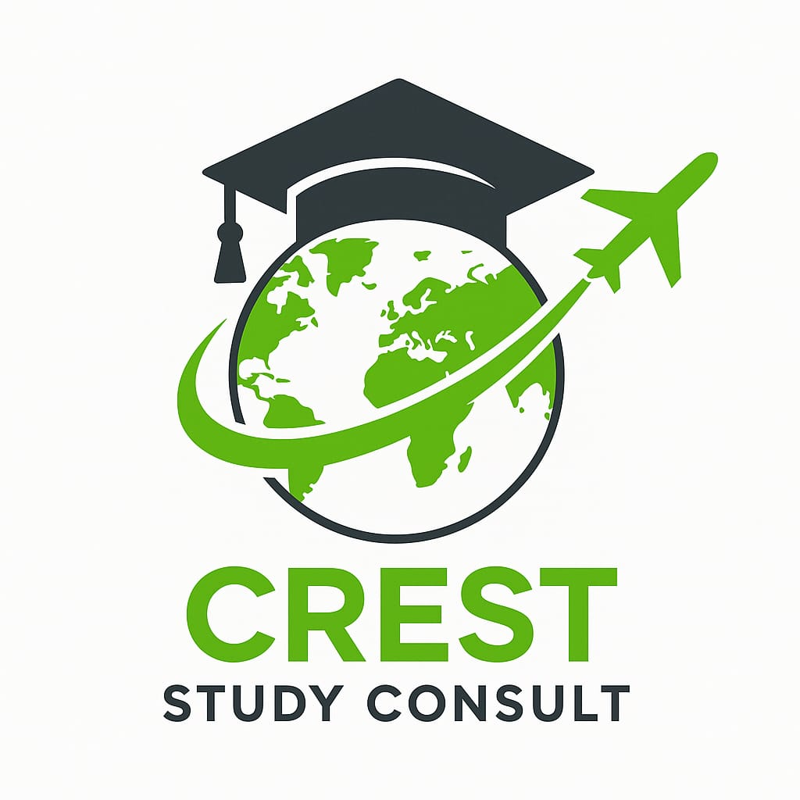

# Crest Study Consult - Study Abroad Dreams Made Reality

## Transform Your Future with World-Class Education

At Crest Study Consult, we guide ambitious students to top universities across the globe with personalized consulting and comprehensive support. Our mission is to make your study abroad dreams a reality.

### 🌟 Why Choose Crest Study Consult?

- **Personalized Guidance**: Tailored advice for your unique educational journey
- **Global Reach**: Access to top universities worldwide
- **Comprehensive Support**: From application to arrival and beyond
- **Expert Consultants**: Experienced professionals in international education
- **High Success Rate**: 98% visa success rate

### 🎓 Our Services

- University Selection and Application
- Visa Application Assistance
- Pre-Departure Orientation
- Scholarship Guidance
- Career Counseling

### 🌍 Popular Study Destinations

- 🇺🇸 USA: World's top universities (Harvard, MIT, Stanford)
- 🇨🇦 Canada: Immigration-friendly policies
- 🇦🇺 Australia: High quality of life
- 🇬🇧 UK: Historic universities and vibrant culture
- 🇮🇪 Ireland: Friendly environment and strong tech industry

### 💼 Student Success Stories

Hear from our students who have successfully embarked on their international education journey with Crest Study Consult.

### 🚀 Get Started

Ready to begin your journey? Book a free initial consultation with our expert advisors.

[Start Your Journey](https://creststudyconsult.com/get-started)

### 📞 Contact Us

- Website: [https://creststudyconsult.com](https://creststudyconsult.com)
- Email: info@creststudyconsult.com
- Phone: +1 (123) 456-7890
- Address: 123 Education Lane, Global City, 12345

### 🔗 Follow Us

- [Facebook](https://facebook.com/creststudyconsult)
- [Twitter](https://twitter.com/creststudyconsult)
- [LinkedIn](https://linkedin.com/company/creststudyconsult)
- [Instagram](https://instagram.com/creststudyconsult)

---

© 2025 Crest Study Consult. All rights reserved.

Keywords: study abroad, international education, university consulting, student support, top universities, global education, study overseas, education consulting
